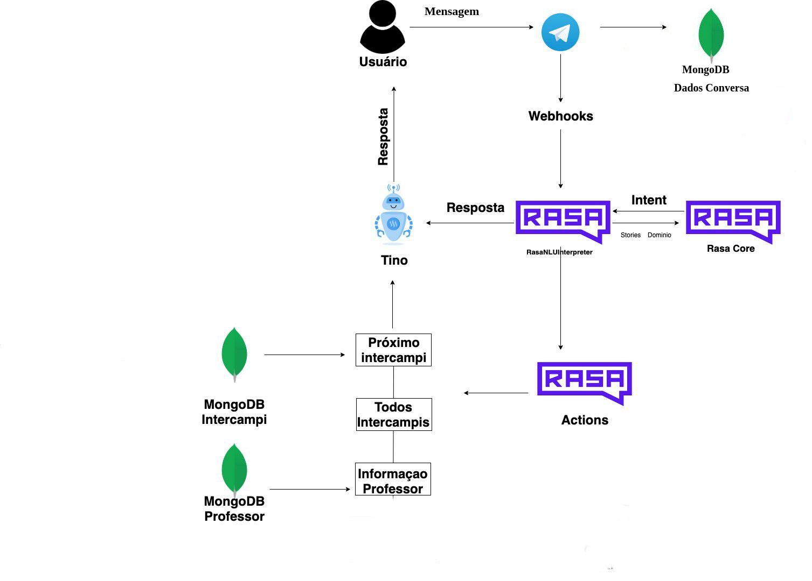

# 2019.1-Tino 

  

<h1 align="center"> Tino - O bot </h1>

  

 &emsp;&emsp;
   Tino é um bot desenvolvido por alunos da FGA-Gama que consegue orientar sobre os horários e destinos do intercampi dos diversos campus da Universidade de Brasília, além de conseguir informar horário de atendimento, sala e contato dos professores que forem cadastrados no bot.Esse repositório contém o código do framework do chatbot Tino, e todos os seus microserviços utilizados.

### Utilização

&emsp;&emsp; O Tino se encontra na plataforma <a href="https://web.telegram.org/#/im?p=@tino_bot">Telegram</a>

### Principais funcionalidades
<html>
 <ul>
  <li>Mostrar os dados de contato  do professor(nome, email e localização)</li>
  <li>Mostrar qual a sala do professor solicitado. Fornecendo tambem instruções de onde encontra-lo</li>
  <li>Mostrar horarios do intercampi de todos os campus da UnB</li>
  <li>Manter uma relação interativa e amigável com o usuário.</li>
  <li>Realizar uma conversação com caráter informativo.</li>
 </ul>
</html>

### Principais Tecnologias utilizadas
<ul>
  <li> Rasa Core (Fluxo de conversa) </li>
  <li> Rasa NLU ( Processamento e extração de informações) </li>
  <li> Flask (microframework utilizado para os microserviços) </li>
  <li> MongoDB (NoSQL database) </li>
</ul>
    
    
### Entenda um pouco da arquitetura:

    
### Para testar a Tino utiizando o telegram, siga os seguintes comandos para subir os containers em seu computador:

#### 1 - Construir imagem do telegram: `sudo docker build -t telegram-jp:latest -f Telegram.Dockerfile .`

#### 2 - Construir a imagem das ações personalizadas do RASA: `sudo docker build -t jp:latest .`

#### 3 - Construir a imagem do microserviço que informa o intercampi: `sudo docker build -t jp-intercampi:latest -f Intercamping.Dockerfile .`

#### 4 - Construir a imagem do microserviço que envia uma imagem com o horário de todos os intercampis: `sudo docker build -t jp-send-pdf:latest -f SendPdf.Dockerfile .`

#### 5 - Com todas as imagens prontas para serem utilizadas, precisamos utilizar uma conexão segura para utilizar como webhook para o telegram, iremos utilizar um pequeno programinha de linha de comando que permite criar um túnel de conexão segura a partir do seu localhost chamado NGROK. (Você encontra a instalação neste link <a href="https://ngrok.com/download" target="_blank">Install ngrok</a>

#### 6 - Com o ngrok instalado, vamos rodar utilizando o seguinte comando: `./ngrok http 5000` (5000 é a porta padrão, caso você tenha alterado o docker-compose.yml, o telegram irá escutar o webhook em outra porta)

#### 7 - Ufa, agora sim podemos subir nossos containers e ser feliz `sudo docker-compose up` para subir todos os containers (incluindo o banco de dados mongo e o redis)

